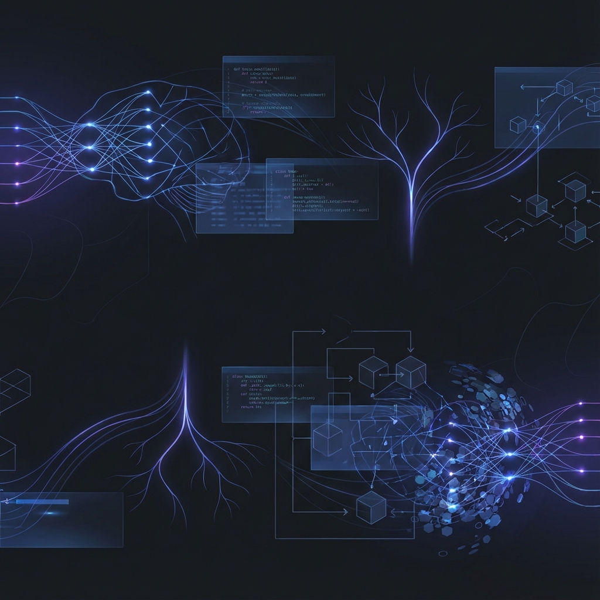

# Notes

> A comprehensive collection of notes on Python, DSA, System Design, AI/ML and more.
> পাইথন, ডিএসএ, সিস্টেম ডিজাইন, এআই এমএল এবং আরও অনেক কিছুর টেক নোট।

- **Python** (পাইথন)
- **Data Structures & Algorithms** (ডিএসএ)
- **System Design** (সিস্টেম ডিজাইন)
- **AI & Machine Learning** (এআই এবং মেশিন লার্নিং)

[Get Started](#dsa-blog)
[GitHub](https://github.com/)

